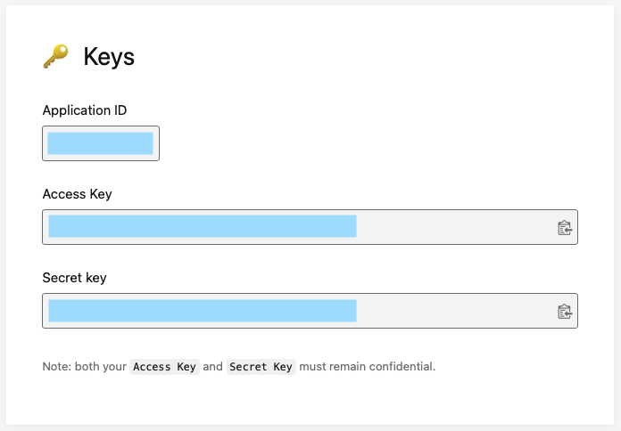

#  GalleryApp for Innowise

## Project Overview

Application for displaying photos provided by `Unsplash API`. Additional information is available for each photo, favorite photos can be saved to `Favorites` collection

## Preview

- **Image Gallery Screen**

Base implementation of Image Gallery Screen

 

- **Image Detail Screen**

Detail screen provides the ability to save an image to favorites

 

- **Error Handling**

Application support to handling errors


## Installation

**1. Install Pods**

Open `Terminal` and go to file for installing `Pods`:

```shell
cd .../GalleryAppForInnowise
pod install
```

**2. Add your Unsplash `access key` to `info.plist`**

Go to [Unsplash](https://unsplash.com) account or create it. Copy access key and paste into the project `info.plist` file



## Functionality Description

**1. UI**

The app supports `dark mode` and is made using system components and the UI is adapted for different devices

**2. Users Logs**

The application outputs logs as it is used

Example:
> "✅ ServiceLocator: did register MainRouterProtocol" \
> "✅ ServiceLocator: did register AlertRouterProtocol" \
> "✅ ServiceLocator: did register WebServiceProtocol" \
> "✅ ServiceLocator: did register BaseProviderProtocol" \
> "✅ ServiceLocator: did register CoreDataServiceProtocol" \
> "▶️ downloading" \
> "👀 Image Gallery Screen" \
> "⏸️ downloading end in: 0.7323719263076782" \
> "👀 Image Detail Screen" \
> "👀 Image Detail Screen" \
> "▶️ downloading" \
> "⏸️ downloading end in: 0.23850607872009277"

## Technical Description

**Programming Languages:** Swift

**Architecture:** MVVM

**Tools:** Xcode, Interface Builder, Postman

**Database:** Core Data

**CocoaPods:**
- **KingFisher** is used to download and cache images\
- **SwiftLint** is used to write the application in a uniform style

## Contacts

Write me if you have any questions

- **GitHub:** [@artemiykutasevich](https://github.com/artemiykutasevich)
- **LinkedIn:** [@artemiykutasevich](https://www.linkedin.com/in/artemiykutasevich/)
- **Telegram:** [@artemiykutasevich](https://t.me/artemiykutasevich)

## Version

version 1.0
